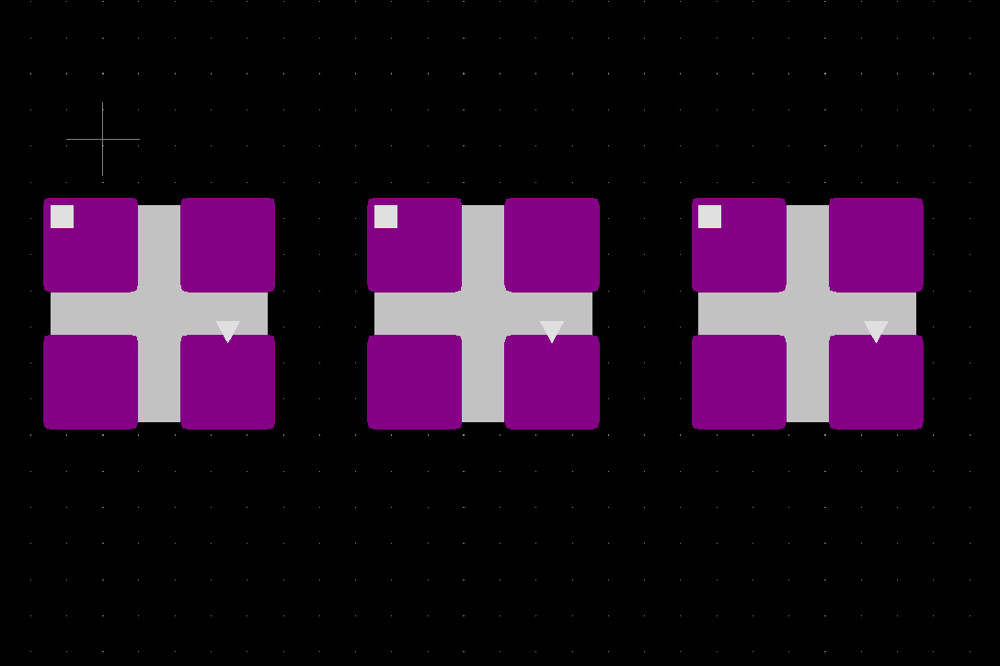
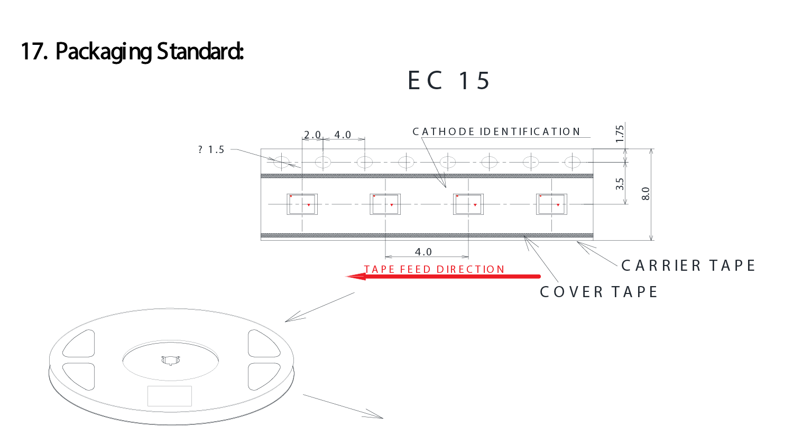
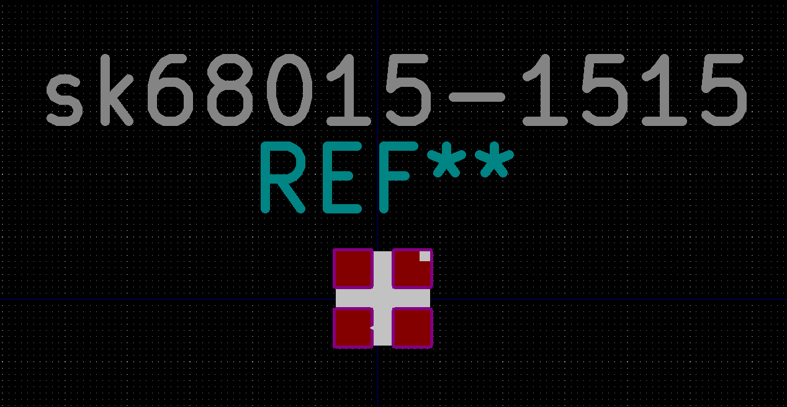
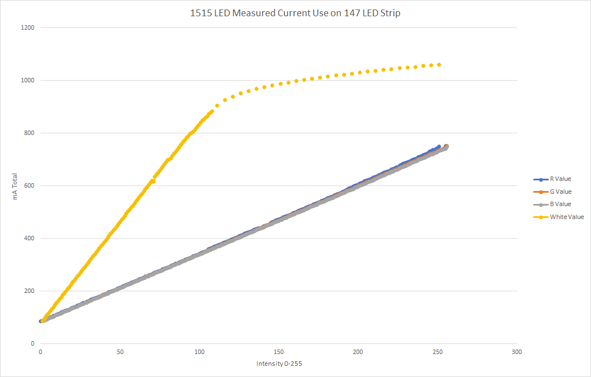

# All about SK6805-1515 LEDs
(Seriously, this is more than you ever wanted to know about these suckers)

These chips are made by a few different people.  
I've seen at least [Normand LED](http://www.normandled.com/upload/201903/SK6805-1515%20LED%20Datasheet.pdf), [iPixel LED](https://cdn-shop.adafruit.com/product-files/4492/Datasheet.pdf), and the various Aliexpress sources. The below information is culled from all these sources plus personal experiance.

## Chip Package and Marking
The chips themselves, as well as being TINY, seem to be marked slightly differently in each production batch. 
The data sheet illustration doesn't quite match most of the ones I've seen. See highlights below:

and

I've had boards assembled to test this **the arrow is pointing towards the VDD pin**, regardless of it the spacing.

The data sheets aren't super helpful in keeping track of the part top and bottom layers. In my KiCad work I've used the following footprint to help keep my own sanity:

This then translates to the following loading diagram for pick and place (red emphasis mine):

Talk to your fab house about which feed direction is right for you.

## KiCad Library
I've made a KiCad 5 library that has all of the above features. Hopefully it saves you headaches. [KiCad library](/kicad_library).

I've also included a STEP file that has the correct rotation marks. [STEP file](/kicad_library/sk6805-1515.stp) 

## LED Current Usage
This is where I've found the least information about these chips. The spec sheet helpfully says `0.1 Watt`. When you scale this to over 1,000 LEDs this has major impacts on your power supply. I decided to do some testing.

## Background About RGB and HSV
See [Adafruit's excellent guide](https://learn.adafruit.com/adafruit-neopixel-uberguide/arduino-library-use#hsv-hue-saturation-value-colors-dot-dot-dot-3024464-41) for further reading. We'll be working in both RGB (great for determining how much power the LED will use) and HSV (great for actually fading between colors in a human-readable way).

## Formula for Current Use
Ultimately, the strangest finding is that the 1515 LEDs use a non-trivial amount of current **while they're not illuminated**. Ultra-low power projects should take this into account. 

After some linear regression of the below data the best formula I've come up with is:

### Iconsumed = ((R+G+B)*0.017813) + 0.58108

Where:
- `R,G and B` are RGB values of the desired color, in 8 bit integer (so, 0-255)
- `Iconsumed` is the current in mA consumed **per LED**
- `0.58108` accounts for the current usage at zero output

While there are very very slight differences between the R, G and B values of the LED, we're going assume they're close enough. 

This will give a slightly higher than expected reading for white values. The slope for white values is more accurately 0.017207 (rather than the 0.0178013, above). This amounts to single digit mA on a 147 LED strip.

### About Gamma Correction
It is entirely possible I coded the gamma correction incorrectly, however I was seeing very strange results. Lower ranges were behaving as they should, eventually what should have been red went to pink, then white. Very odd.  
See [Adafruit](https://learn.adafruit.com/led-tricks-gamma-correction) about gamma correction. It IS important, even if I couldn't get it to work correctly. 

## Test Methodology
This was tested using the following:
- 2x [Adafruit Ultra Skinny 1515 Strip](https://www.adafruit.com/product/4368) soldered together and slightly modified for a total of 148 LEDs (although only 147 were lit). Only powered from 1 side of the strip.  
- [Siglent SPD3303X-E Power Supply](https://siglentna.com/power-supplies/spd3303x-spd3303x-e-series-programmable-dc-power-supply/) set to 5.00V with a current limit set to 2A
- [Fluke 789 ProcessMeter](https://www.fluke.com/en-us/product/calibration-tools/ma-loop-calibrators/fluke-789) using the `mA` scale. This unit claims accuracy to `0.2% + 2`
- [Test Code I wrote](led-evaluation-code/led-eval-code-rev00.in) 
- Excel to log results by hand (yes, this was as frustrating as it sounds)

Measuring the current current going into the LED strip with the Fluke meter (wired in series) and ground truthing it against the power supply. 

### Graphs

We can see that the current use of the R, G and B values is very very close to identical.  

The rapid non-linearity of the white values around 100/255 intensity is due to the traces in the strip no longer being negligible resistors. Simply; the first bunch of LEDs were drawing a ton of power and the latter ones were seeing a large voltage drop. This is why it's recommended to power these strips from both ends and possibly mid-span as well.

For our math, I have only used the white intensity up to about 100/255, to avoid the resistance problems.

